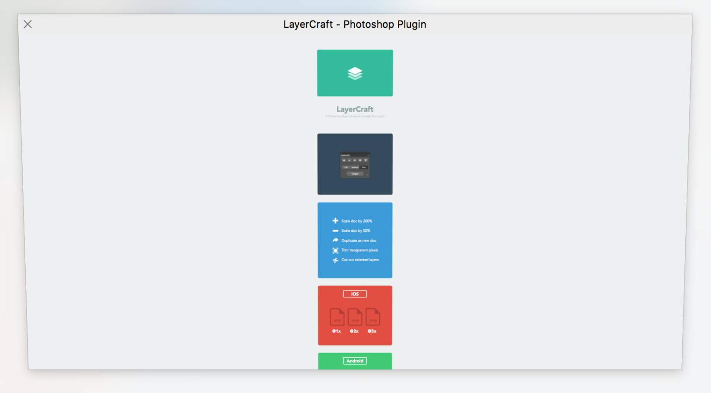
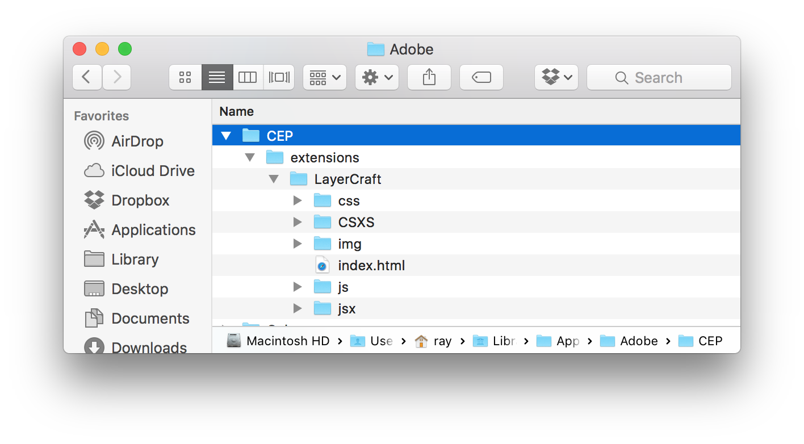
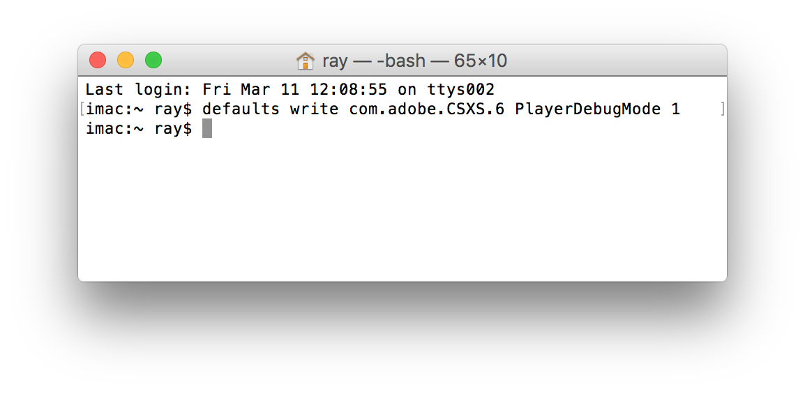

# Introduction: [http://lab.rayps.com/lc/](http://lab.rayps.com/lc/)

## Installation (Mac)

#### 1. Download repo, unzip and move folder into the extensions folder

[**Download**](https://github.com/RayPS/LayerCraft/archive/master.zip)

	/Library/Application Support/Adobe/CEP/extensions
	
*(you may have to create folder if it doesn't already exist)*

Should look like this:

#### 2. Set PlayerDebugMode to 1

Open `Terminal`, type:

	defaults write com.adobe.CSXS.6 PlayerDebugMode 1

Then press `return`

#### 3. Reopen Photoshop

---

## Installation (Windows)

#### 1. Download repo, unzip and move folder into the extensions folder
[**Download**](https://github.com/RayPS/LayerCraft/archive/master.zip)

	C:\Program Files (x86)\Common Files\Adobe\CEP\extensions

*(you may have to create folder if it doesn't already exist)*

#### 2. Set PlayerDebugMode to 1

Run `regedit` > `HKEY_CURRENT_USER/Software/Adobe/CSXS.6`

Add a new entry `PlayerDebugMode`
type:`string` value:`"1"`.  

Reopen Photoshop (May require restart or relogin)

